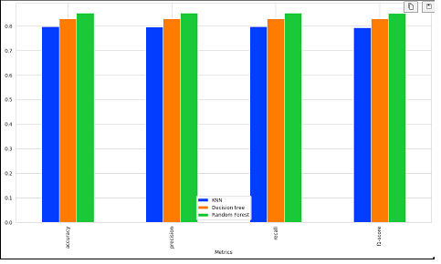

# Driver's License Type Prediction

## Introduction

This project aims to classify the license type of the drivers located in Dubai. 

## Dataset

We have Data from Driver's population census in Dubai. The dataset contains overall 5 columns of which 1 column contain content in Arabic linguistics and the rest are numeric and object types. The dataset is provided in the repository.

### Dataset Statistics:

Here is sample statistics of the data.

- **Name:** Drivers_Population_Census
- **Mode:** Tabular Data
- **Number of Samples:** 
  - Train: 2,247 
  - Test: 561
- **Type:** Classification
- **Number of Classes:** 4
- **Classes Name:** 
  - Registration
  - Transfer of Ownership
  - Change number plate
  - Update Info

## Pre-processing

The preprocessing steps of the proposed project are the following:
<list of preprocessing steps>

1. Made new list and replaced Arabic Linguistics content into English linguistics
2. Apply One-hot encoding on Gender and age_group columns
3. Apply Label encoding on Nationality and License_type columns
4. To avoid over sampling we use sampling_strategy method from SMOTE module to avoid class imbalancing

## Models

For the Traffic License Prediction in Dubai following models were trained with the tuned hyperparameters:

- **K-Nearest Neibhour**
  - n_neighbors=3

- **Decision Tree**
  - GridSearchCV with parameter 
      - criterion : ['gini', 'entropy'],
      - splitter : ['best', 'random'],
      - max_depth : [None, 10, 20, 30, 40, 50],
      - min_samples_split : [2, 5, 10],
      - min_samples_leaf : [1, 2, 4],
      - max_features : ['auto', 'sqrt', 'log2', None]
  - cross validation = 5
  - scoring = f1
  - estimator=dt_model

  **Random Forest**
  - GridSearchCV with parameter 
      - criterion : ['gini', 'entropy'],
      - min_sample_leaf = [1, 2, 4]
      - max_depth : [None, 10, 30],
  - cross validation = 5
  - scoring = accuracy
  - estimator=rf_model

## Results

| Metrics    |    KNN   | Decision Tree | Random Forest |
|------------|----------|---------------|---------------|
| Accuracy   | 0.796889 |     0.829826  |     0.852242   |
| Precision  | 0.796594 |     0.830111  |     0.852526   |
| Recall     | 0.796921 |     0.829830  |     0.852233   |
| F1-Score   | 0.792896 |     0.829060  |     0.851289   |

 

 

# Author
**Arslan Ahmad**  
**Research Officer**  
***National Center of Artificial Intelligence (NCAI)***  
*AL-Khawarizmi Institute of Computer Science (KICS)* UET Lahore  

